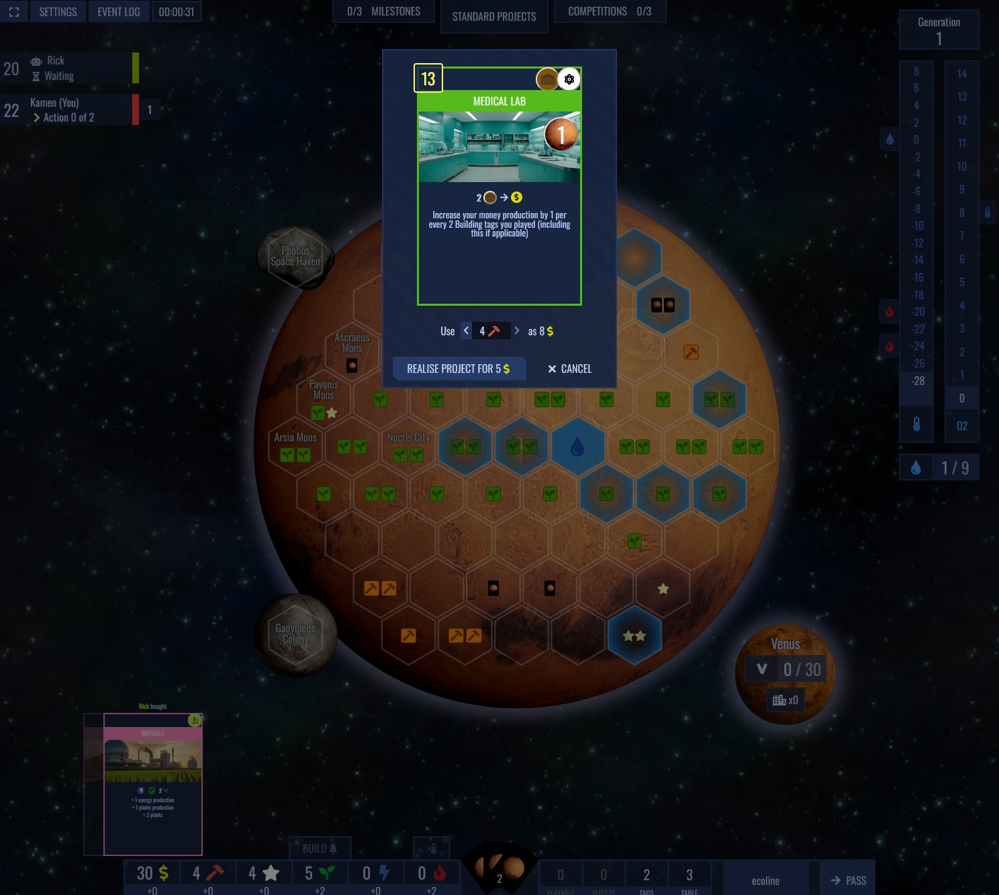

Open source implementation of terraforming focused board game. Not associated with Firaxis Games.

You can play it at https://terraforming.cerno.ch or just host it yourself.

## Screenshots





## Features

 - **Multiplayer**
 - **Fully interactive UI**
 - **Bots**
 - **Self hostable**

## Hosting

Easiest way to host is to use prepared docker image. See example `docker-compose.yml`:

```yaml
services:
  open_terraforming:
    image: openterraforming/open-terraforming
    container_name: open_terraforming
    ports:
      - 8000:80
    volumes:
      - data:/data
    restart: unless-stopped

volumes:
  data:
```

Or you can use raw docker:

1. Create a Docker volume named data:
```sh
docker volume create data
```

2. Run the open_terraforming container:

```sh
docker run -d \
  --name open_terraforming \
  -p 8000:80 \
  -v data:/data \
  --restart unless-stopped \
  openterraforming/open-terraforming
```

These commands will create the necessary volume and run the container with the specified configurations.

## Contributing
