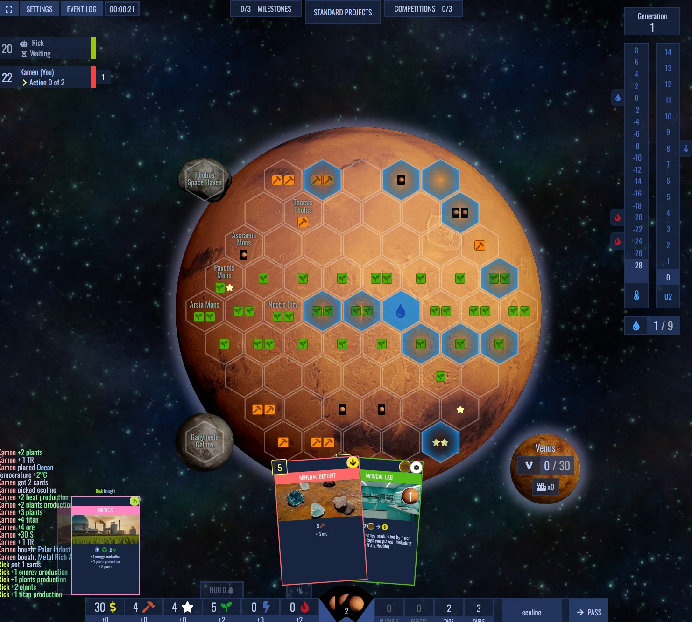
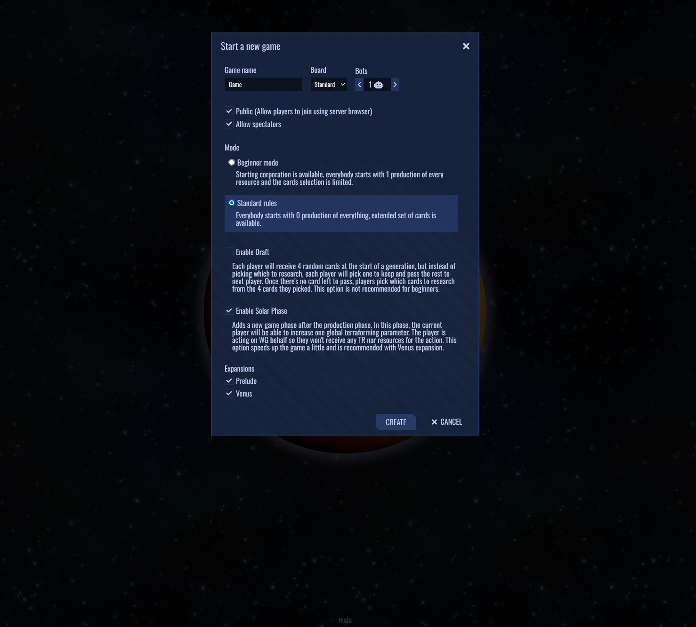

Open source implementation of terraforming focused board game. You can play it at https://play.open-terraforming.eu or just host it yourself.

Not associated with Firaxis Games.

## Screenshots

## Features

 - **Web application** - all you need to play is your browser
 - **Multiplayer** - play with your friends by simply sharing a link
 - **Fancy UI** - hand crafted UI with animations, almost like a real game
 - **Bots** - they aren't very smart, but they're there!
 - **Self host** - you can run it just for yourself!
 - **Open Source** - you can change anything you want, create your own expansions, the possibilities are endless!

## Hosting

Docker image: `openterraforming/open-terraforming`

See [wiki/Hosting](https://github.com/open-terraforming/open-terraforming/wiki/Hosting) for details and docker compose example.

## Contributing

See [wiki/Contributing](https://github.com/open-terraforming/open-terraforming/wiki/Contributing)